# Oficina : Desenvolvendo um ChatBot de Horoscopo no Telegram com Python

## Passos:

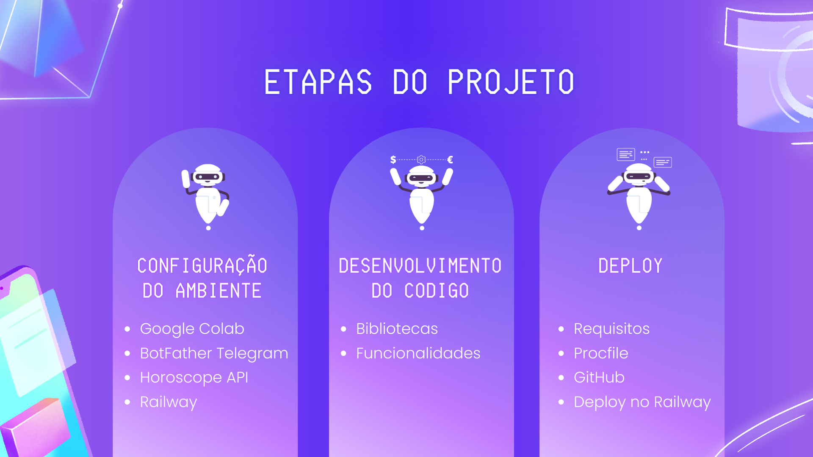

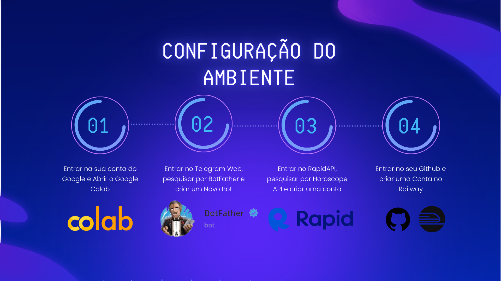
* Google Colab: https://colab.google/ 
* BotFather: https://t.me/botfather
* RapidAPI -> Horoscope API: https://rapidapi.com/webarjos/api/horoscope-api
* Railway: https://railway.app/

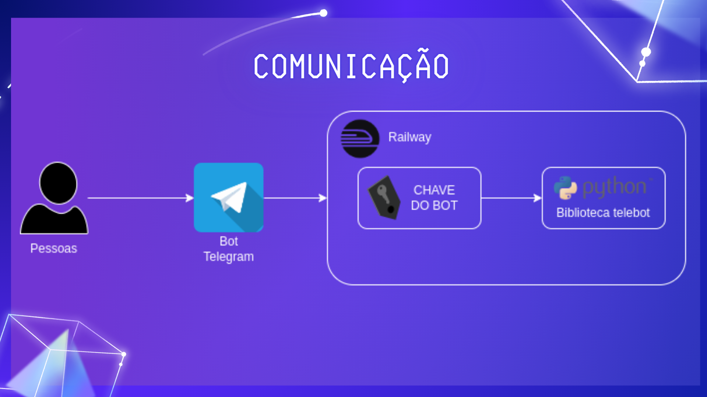

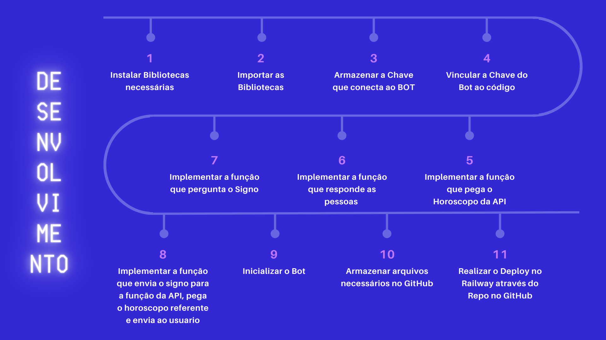

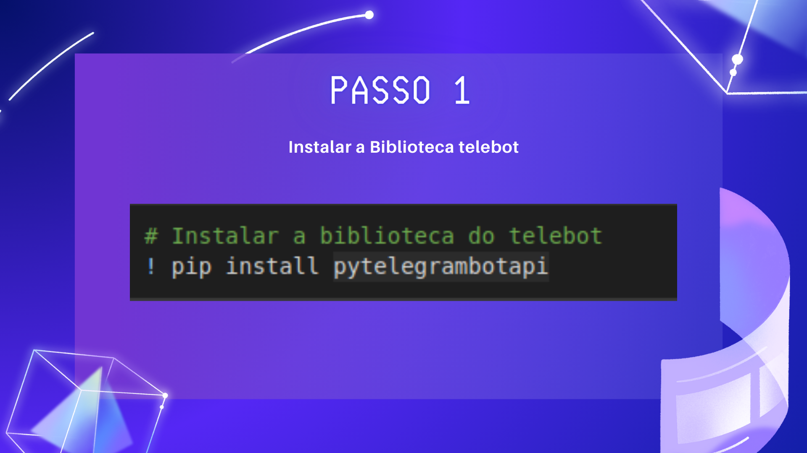

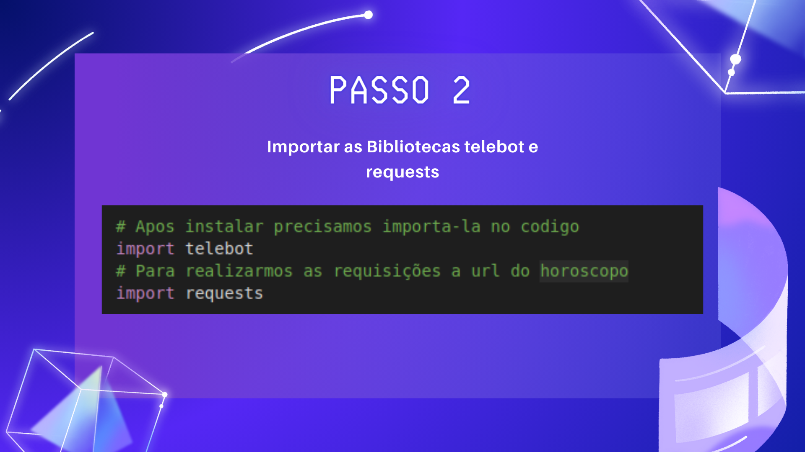

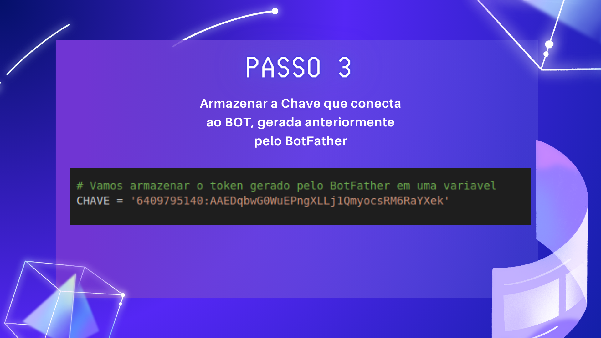
* Coloque entre as aspas a Chave gerada pelo BotFather 

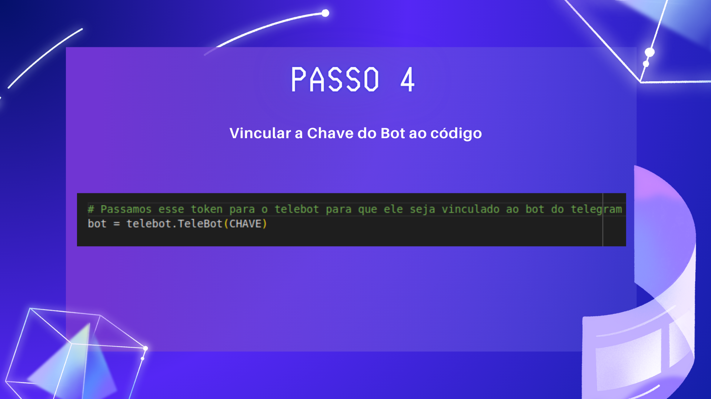

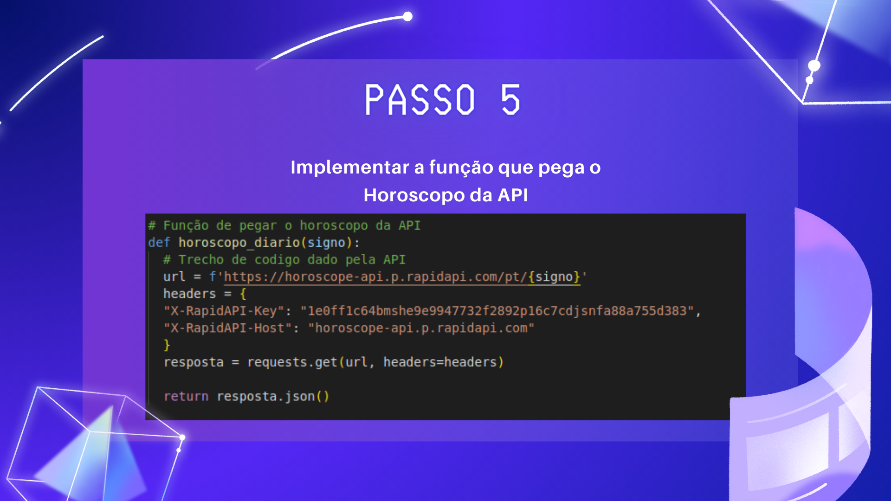
* No Horoscope API do RapidAPI, vá em Code Snippets, selecione Python -> Requests e troque o headers do codigo pelo headers gerado para você

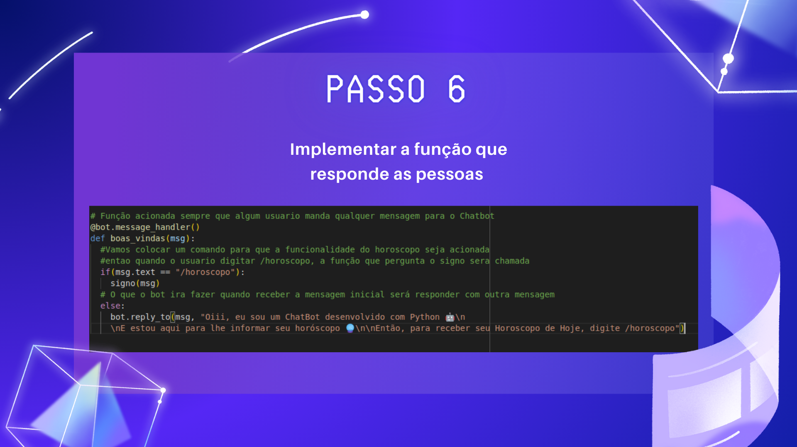

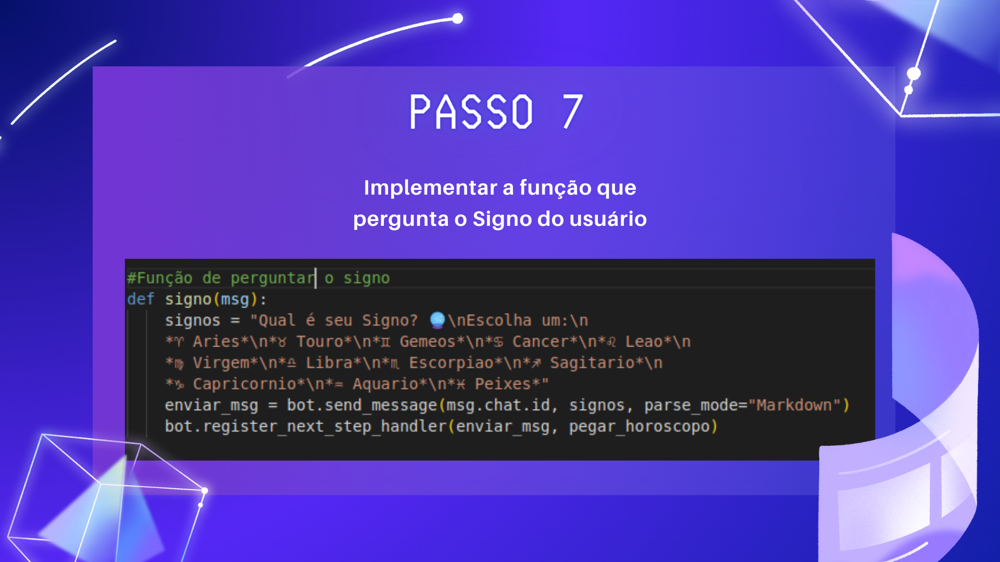

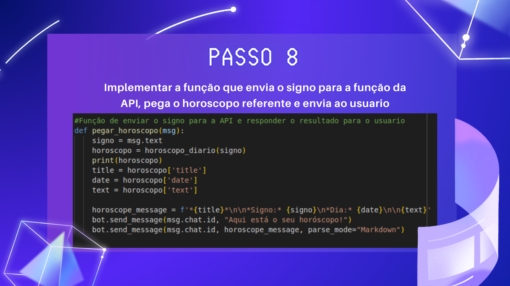

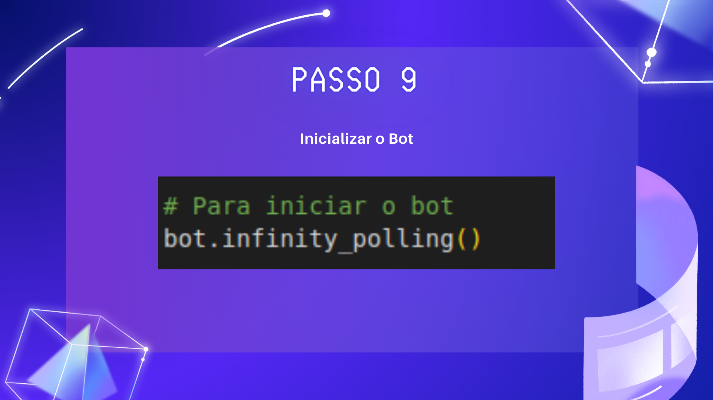

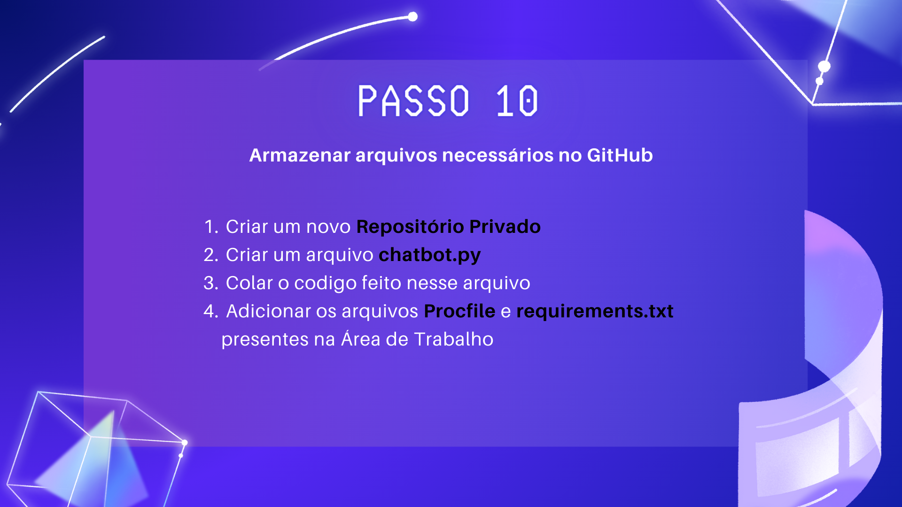

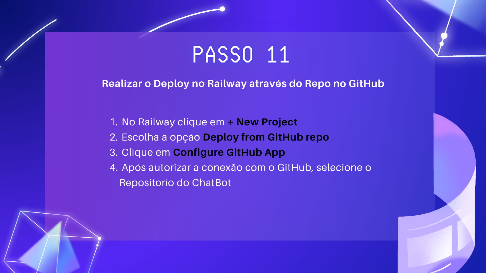

